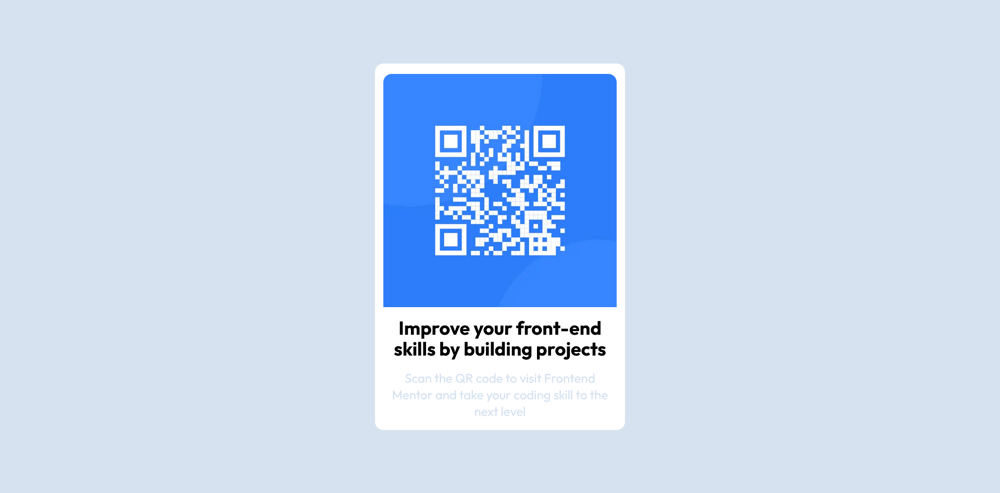

# Frontend Mentor - QR code component solution

This is a solution to the [QR code component challenge on Frontend Mentor](https://www.frontendmentor.io/challenges/qr-code-component-iux_sIO_H). Frontend Mentor challenges help you improve your coding skills by building realistic projects. 

## Table of contents

- [Overview](#overview)
  - [Screenshot](#screenshot)
  - [Links](#links)
- [My process](#my-process)
  - [Built with](#built-with)
  - [What I learned](#what-i-learned)
  - [Continued development](#continued-development)
  - [Useful resources](#useful-resources)
- [Author](#author)

## Overview

### Screenshot

### Links

- Solution URL: [Add solution URL here](https://your-solution-url.com)
- Live Site URL: [Add live site URL here](https://your-live-site-url.com)

## My process

### Built with

- Semantic HTML5 markup
- CSS custom properties
- Flexbox
- [React](https://reactjs.org/) - JS library
- [Next.js](https://nextjs.org/) - React framework
- [Tailwind](https://https://tailwindcss.com//) - For styles

### What I learned

The project is straightforward and does not require much that I don't already know. Fun project though. 

### Useful resources

- [resource 2](https://livebook.manning.com/book/next-js-in-action/welcome/v-2/) 
    - Great book for React introduction

## Author

- Github - [awesooomeME](https://github.com/awesooomeME)
- Frontend Mentor - [@awesooomeME](https://www.frontendmentor.io/profile/awesooomeME)